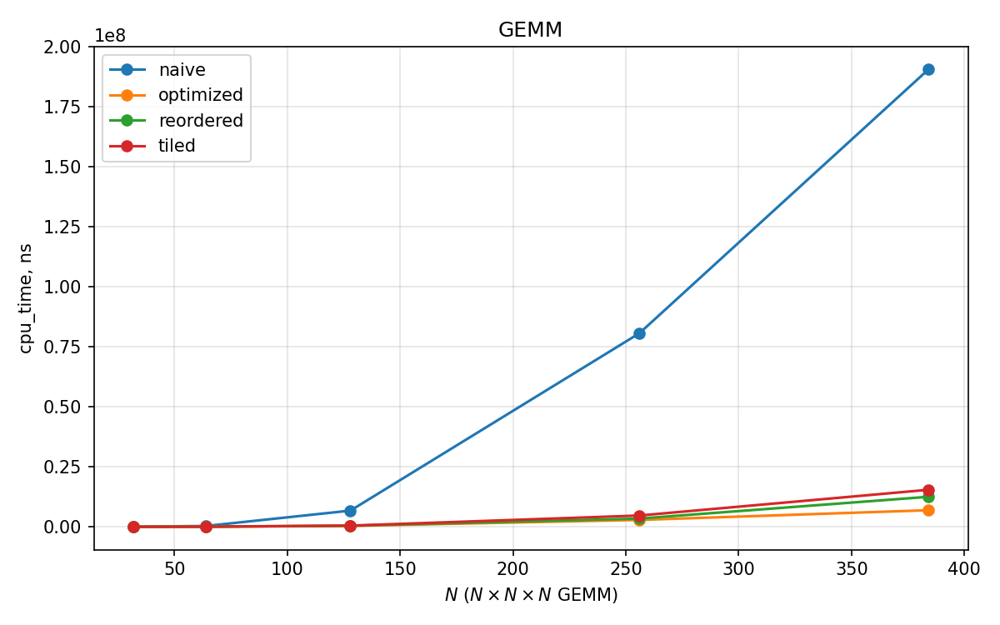
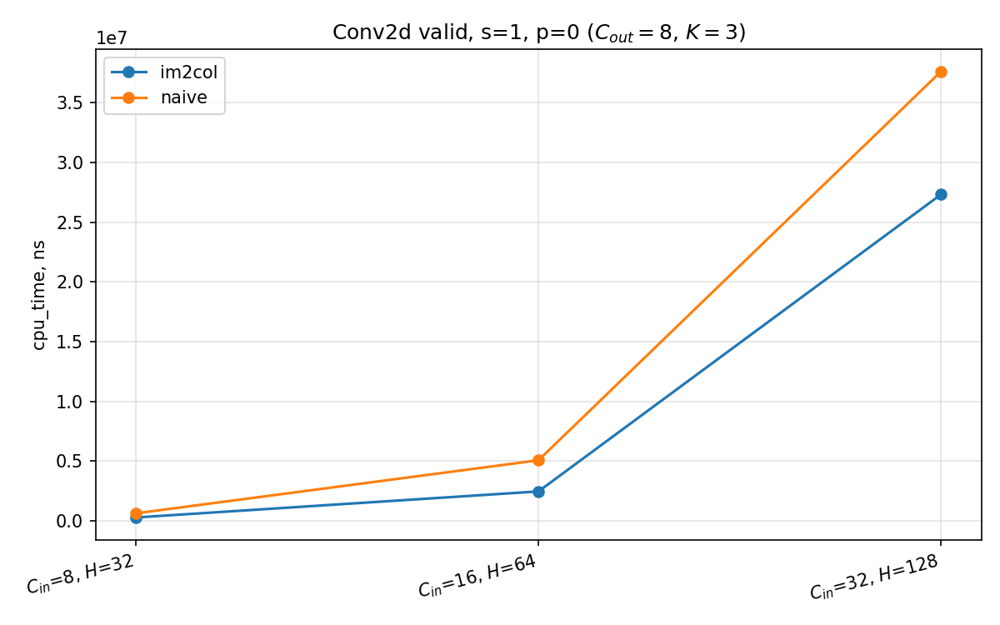

# Kernels

В рамках исследования реализованы **GEMM** и **2D-свёртка** (NCHW), тесты на согласованность с наивными эталонами и измерения через **Google Benchmark**.

## Сборка

### Зависимости

**C++20**, **CMake** $\geq 3.16$, **GTest** (**libgtest-dev**).

Установка зависимостей:
```shell
sudo apt install -y build-essential cmake pkg-config libgtest-dev
```
Установка **Python** зависимостей:
```shell
sudo apt install -y python3 python3-pip python3-venv
```

Компиляция бенчмарка `build/kernels/kbenchmark`:
```shell
mkdir build && mkdir build/kernels
cmake -S kernels -B build/kernels -DCMAKE_BUILD_TYPE=Release
cmake --build build/kernels -j$(nproc)
```

Для архитектуры **x86_64** при компиляции `kernels` указываются флаги `-mavx2` `-mfma` ([CMakeLists.txt](CMakeLists.txt)).

## Тесты

Чтобы отключить компиляцию тестов требуется указать `-DBUILD_TESTS=OFF`.

Запуск тестов:
```shell
ctest --test-dir build --output-on-failure
```

## Платформа

- Ядро: `Linux 6.8.0-40-generic` 
- OC: `Ubuntu 24.04.4 LTS`
- CPU: `AMD Ryzen 5 5600H with Radeon Graphics`, `6` ядер / `12` потоков
- Архитектура: `x86_64`, `little-endian`
- ISA: `AVX2`, `FMA`
- Кеш:

| Кеш | Тип | Размер на экземпляр | Экземпляров | Суммарно | 
|---------|-----|---------------------|-------------|---------------------------|
| L1d | Data | 32 KiB | 6 | 192 KiB |
| L1i | Instruction | 32 KiB | 6 | 192 KiB |
| L2 | Unified | 512 KiB | 6 | 3 MiB |
| L3 | Unified | 16 MiB | 1 | 16 MiB |

Размер тайлинга **64×64×64** по `float` позволяет укладывать блоки порядка десятков KiB на подматрицу в кеш. Одна линия кэша для `float` составляет 16 элементов (64 байта).

## Результаты

Минимальное время одной итерации для стабилизации замеров задаётся флагом `--benchmark_min_time=0.2s`:

```shell
./build/kernels/kbenchmark --benchmark_min_time=0.2s
```

### Gemm

$A \in \mathbb{R}^{M \times K}$, $B \in \mathbb{R}^{K \times N}$, $C = AB$.

Оптимизации:
| Функция | Реализация |
|---------|------|
| `matmul_naive` | Цикл `i, j, k` |
| `matmul_reordered` | Цикл `i, k, j` |
| `matmul_tiled` | Тайлинг $64^3$ по $M,N,K$ |
| `matmul_optimized` | Тайлинг, AVX2+FMA|

Входные размеры матриц: $N \times N$

| $N$ | Naive, нс | Reordered, нс | Tiled, нс | Optimized, нс |
|------:|------:|----------:|------:|------------:|
| 32 | 23149 | 4191 | 3561 | 3489 |
| 64 | 195862 | 20314 | 19827 | 17887 |
| 128 | 3016210 | 144244 | 167434 | 152608 |
| 256 | 30983013 | 1148065 | 1513119 | 1411668 |
| 384 | 62597228 | 4026075 | 4653327 | 4253813 |

На малых $N$ переупорядочивание и тайлинг дают порядок улучшения над наивным циклом. Версия **optimized** (Tiled + AVX2 + FMA) не даёт сильного прироста относительно простого тайлинга.

### Conv

Оптимизации:
| Функция | Реализация |
|---------|------|
| `conv2d_naive` | Вложенные циклы |
| `conv2d_im2col` | `Im2Col` + `matmul_optimized` |


Параметры светки:
- stride = 1
- pad = 0
- $C_{out}=8$
- $K=3$ (размер ядра)
- $W=H$ (размеры входного тензора)

| $C_{in}$ | $H$ | Naive, нс | Im2Col, нс |
|-----------:|------:|-----------:|------------:|
| 8 | 32 | 461992 | 274594 |
| 16 | 64 | 4151037 | 2363814 |
| 32 | 128 | 34708225 | 23479982 |

**Im2Col** оптимизация стабильно быстрее наивной шестивложенной реализации, в качестве расходов выделяется дополнительная память под дополнительный тензор.


### Графики

Для построения графиков требуется произовести вывод данных в CSV и построение скриптом [plot_benchmark.py](plot_benchmark.py)

Вывод в CSV:

```shell
./build/kernels/kbenchmark --benchmark_format=csv --benchmark_min_time=0.2s > kernels_bench.csv
```

Построение графиков
```shell
python3 -m venv --prompt kernels kernels/.venv
source kernels/.venv/bin/activate
pip install -r kernels/requirements.txt
```

```shell
python3 kernels/plot_benchmark.py --csv kernels_bench.csv --out-dir kernels/figures
```
Для логарифмического масштаба следует добавить `--log`.

Примеры:



