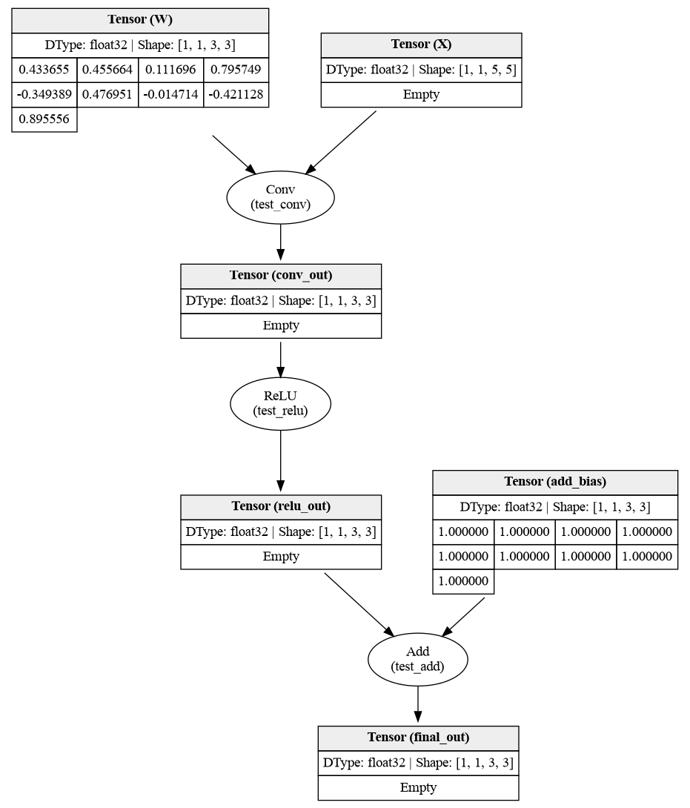

# Tensor Compiler

Проект представляет из себя экспериментальный компилятор нейросетевых графов. 

## Cхема работы

Компилятор производит загрузку графа нейронной сети в формате **ONNX**, строит внутреннее представление `ComputeGraph`, переводит его в **MLIR** (диалекты *Linalg*, *Tensor*, *Arith* и др.), затем производит понижение до **LLVM IR**. Из **LLVM IR** могут быть сгенерированы: файл представления LLVM (`.ll`), ассемблер (`.s`) и объектный файл (`.o`). Опционально можно сохранить **PNG** визуализации графа через **Graphviz**.

> ONNX → ComputeGraph → MLIR → LLVM IR → .ll / .s / .o

Поддерживаемые на уровне загрузки **ONNX** операторы (см. `ComputeGraphFactory`): **Conv**, **Gemm**, **MatMul**, **Add**, **Mul**, **Relu**; остальные типы узлов при разборе модели приведут к ошибке.

## Сборка
### Зависимости

- **C++20**, **CMake** (>=3.16)
```shell
sudo apt update
sudo apt install -y build-essential cmake pkg-config libgtest-dev
```
- **Python** от (>=3.12)
```shell
sudo apt install -y python3 python3-pip python3-venv
```

- **Graphviz**
```shell
sudo apt install -y libgraphviz-dev graphviz
```
- **Protocol Buffers** и **ONNX**
```shell
sudo apt install -y protobuf-compiler libprotobuf-dev libonnx-dev
```

Установка сразу всех зависимостей :
```shell
sudo apt update
sudo apt install -y \
  build-essential cmake pkg-config libgtest-dev \
  python3 python3-pip python3-venv \
  libgraphviz-dev graphviz \
  protobuf-compiler libprotobuf-dev libonnx-dev \
  ninja-build clang lld zlib1g-dev libffi-dev libxml2-dev
```

- **LLVM** и **MLIR**

Сборка LLVM:
```shell
sudo apt-get update
sudo apt-get install -y ninja-build clang lld zlib1g-dev libffi-dev libxml2-dev

git clone https://github.com/llvm/llvm-project.git
cd llvm-project && mkdir build && cd build

cmake -G Ninja ../llvm \
  -DLLVM_ENABLE_PROJECTS="mlir" \
   -DLLVM_TARGETS_TO_BUILD="Native" \
   -DCMAKE_BUILD_TYPE=Release \
   -DLLVM_ENABLE_ASSERTIONS=ON \
   -DLLVM_ENABLE_RTTI=ON \
   -DLLVM_USE_LINKER=lld \
   -DCMAKE_C_COMPILER=clang \
   -DCMAKE_CXX_COMPILER=clang++ \
   -DLLVM_INCLUDE_TESTS=OFF \
   -DLLVM_INCLUDE_EXAMPLES=OFF

ninja
sudo cmake --install .
```

- Установка **Python** зависимостей:

```shell
sudo apt install -y python3 python3-pip python3-venv
python3 -m venv --prompt tc .venv
source .venv/bin/activate
pip install -r requirements.txt
```

### Сборка проекта

> #### `build/tcompiler`

Файл представляет из себя реализацию тензорного компилятора

```shell
cmake -S . -B build -DCMAKE_BUILD_TYPE=Release
cmake --build build -j$(nproc)
```

Если компилятор не видит заголовки LLVM, следует указать флаг `-DCMAKE_PREFIX_PATH="/path/to/llvm-install"`

Для генерации файла `compile_commands.json` в [CMakeLists.txt](CMakeLists.txt)по умолчанию`-DCMAKE_EXPORT_COMPILE_COMMANDS=ON`.

> #### `build/model_driver`

Драйвер для запуска инференса модели нейронной сети. Компилируется при опции `BUILD_KERNEL_DRIVER=ON` на основе `models/model.onnx`. Модуль запускает скомпилированную в `model.o` нейросеть, слинкованную с драйвером для запуска. Модель запускается через интерфейс `_mlir_ciface_forward`. Реализация инференса сети представлена в исходном файле [src/driver.cpp](src/driver.cpp).

По умолчанию `BUILD_KERNEL_DRIVER=OFF` (см. [CMakeLists.txt](CMakeLists.txt)). 

Есть возможность скомпилировать драйвер с моделью вручную:

```shell
mkdir obj
./build/tcompiler -o obj/model.o <path/to/model.onnx>
g++ -std=c++20 -c src/driver.cpp -o obj/driver.o
g++ obj/driver.o obj/model.o -o model
./model
```

### Тесты

Чтобы отключить компиляцию тестов требуется указать `-DBUILD_TESTS=OFF`.

Запуск тестов:
```shell
ctest --test-dir build
```

## Генерация ONNX

Генерация тестовой ONNX модели для сценария end-to-end представлена в файле [end2end/gen.py](end2end/gen.py). С помощью скрипта можно генерировать модель (по умолчанию в `models/model.onnx`). Инференс модели производится с помощью **PyTorch** скриптом [end2end/pytorch_reference.py](end2end/pytorch_reference.py).


## CLI (tcompiler)

Для вывода подсказки следует указать флаг `-h`. На вход программа получает как обязательный аргумент путь к `model.onnx`. Дополнительно нужен хотя бы один из выходов: `-o` для объектного файла, `-S` для ассемблера, `-l` для LLVM IR или `-G` для изображения графа сети. Также есть возможность передать опции для **LLVM**

Сводная таблица:
| Опция | Описание |
|--------|----------|
| `-h`, `--help` | Справка |
| `-o [path]` | Генерация объектного файла (по умолчанию `results/out.o`) |
| `-S [path]` | Генерация ассемблера (по умолчанию: `results/out.s`) |
| `-l [path]` | Дамп LLVM IR (`.ll`) (по умолчанию: `results/out.ll`) |
| `-G [path]` | PNG графа `ComputeGraph` в Graphviz (по умолчанию: `results/graph.png`) |
| `--llvm-triple=...` | Triple для LLVM `TargetMachine` |
| `--llvm-cpu=...` | Имя CPU для LLVM |
| `--llvm-features=...` | Строка subtarget features |
| `--reloc=pic\|static\|default` | Модель релокации |

Примеры:

```shell
./build/tcompiler model.onnx -o out.o
./build/tcompiler model.onnx -S -o out.o
./build/tcompiler model.onnx -G -l dump.ll
./build/tcompiler --llvm-cpu=generic model.onnx -o out.o
```

Пример визуализации модели:



## Оптимизации

Чтобы провести оптимизации над LLVM IR, можно скомпилировать файл представленя `.ll` с помощью `opt` с опцией оптимизации, например `-O3`. Далее скомпилировать полученное представление с помощью `llc`:

```shell
mkdir obj
./build/tcompiler -l obj/model.ll <path/to/model.onnx>
opt -O3 obj/model.ll -S -o obj/optimized.ll
llc --relocation-model=pic -O3 -filetype=obj obj/optimized.ll -o obj/opt_model.o
```

А затем скомпилировать и слинковать драйвер:
```shell
g++ -std=c++20 -fPIE -c src/driver.cpp -o obj/driver.o
g++ obj/driver.o obj/opt_model.o -o opt_model
./opt_model
```

## Особенности

На данном этапе при переводе в MLIR не поддерживается броадкастинг размерностей тензоров для операций, т.е. размерности должны соотноситься четко. Для визуализации броадкастинг доступен, но при переводе в MLIR или LLVM возникнет ошибка несоответствия размерностей.